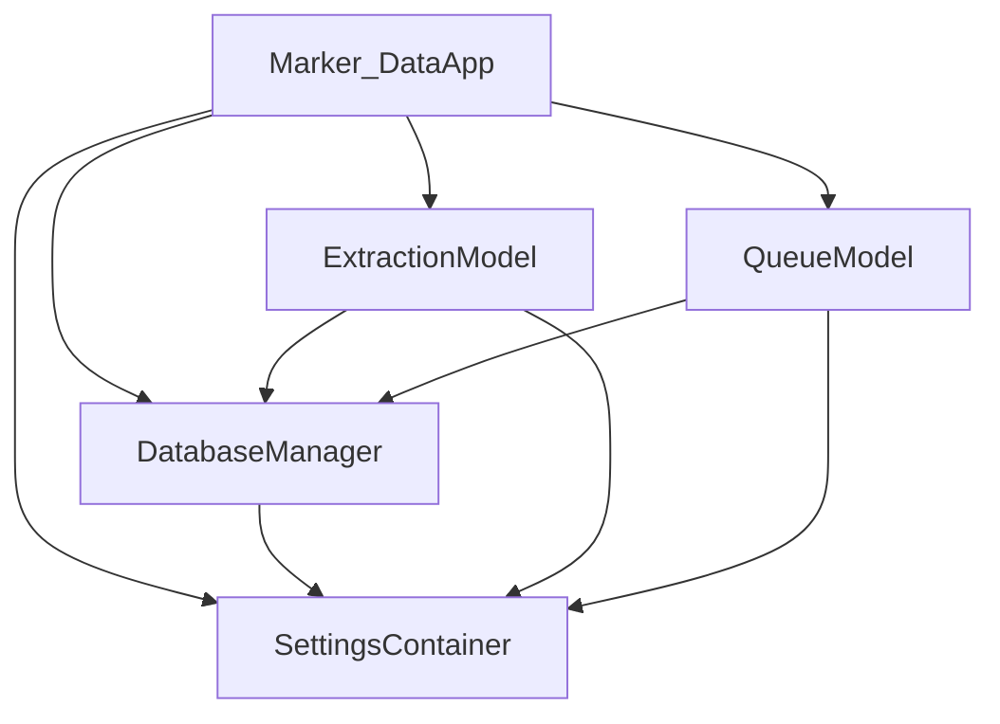
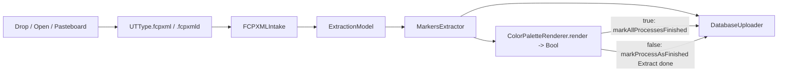
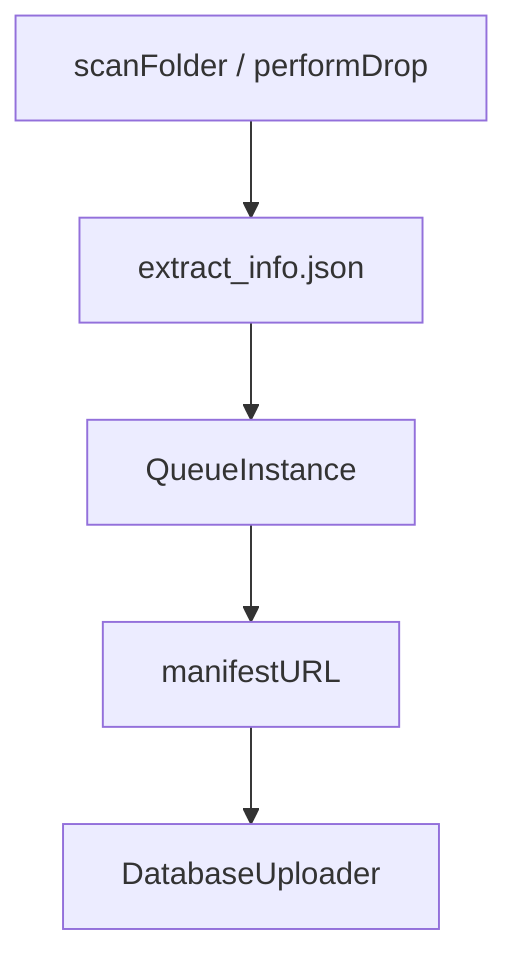
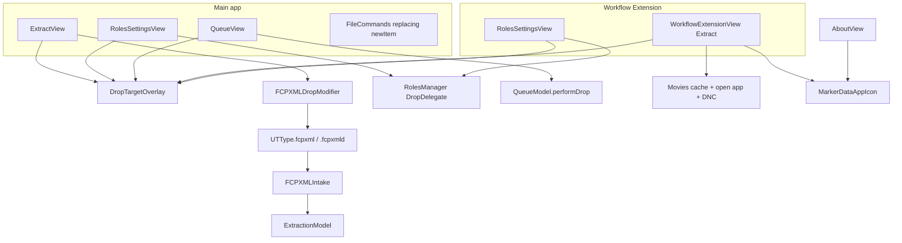
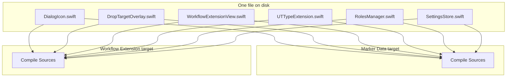
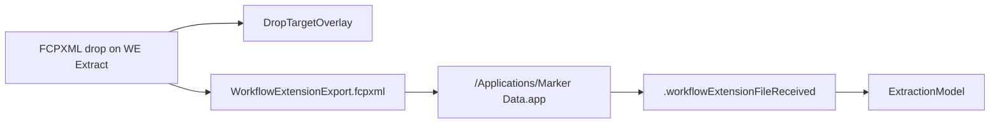
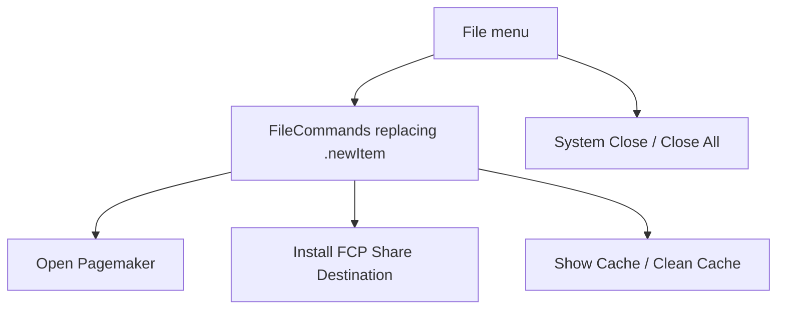
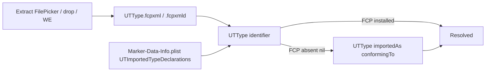
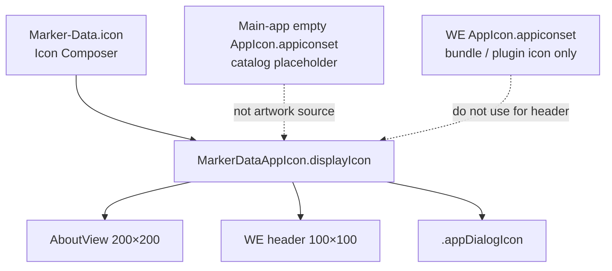

# ARCHITECTURE.md

## Table of contents

- [Overview](#overview)
- [Targets & modules](#targets--modules)
  - [Main app target (`Marker Data`)](#main-app-target-marker-data)
  - [Workflow Extension target](#workflow-extension-target)
  - [Uninstaller target (`Uninstall Marker Data`)](#uninstaller-target-uninstall-marker-data)
  - [Share Destination / scripting bridge (inside main app)](#share-destination--scripting-bridge-inside-main-app)
- [High-level runtime graph](#high-level-runtime-graph)
  - [Navigation](#navigation)
- [Data & persistence](#data--persistence)
  - [App Support & cache layout](#app-support--cache-layout)
  - [Settings system](#settings-system)
    - [Key types and files](#key-types-and-files)
    - [What gets persisted where](#what-gets-persisted-where)
    - [Runtime lifecycle (app launch)](#runtime-lifecycle-app-launch)
    - [Schema versioning](#schema-versioning)
    - [Auto-save and configurations](#auto-save-and-configurations)
    - [Bridge to extraction (`markersExtractorSettings`)](#bridge-to-extraction-markersextractorsettings)
    - [Exception: Roles (`RolesManager`)](#exception-roles-rolesmanager)
    - [Checklist: adding or changing a persisted setting](#checklist-adding-or-changing-a-persisted-setting)
- [Core flows](#core-flows)
  - [1) Extract flow (interactive)](#1-extract-flow-interactive)
  - [2) Queue flow (batch upload)](#2-queue-flow-batch-upload)
  - [3) Database upload flow](#3-database-upload-flow)
  - [4) Workflow Extension handoff](#4-workflow-extension-handoff)
  - [5) Share Destination handoff](#5-share-destination-handoff)
- [Color swatch pipeline](#color-swatch-pipeline)
- [Database profiles](#database-profiles)
- [UI architecture](#ui-architecture)
- [File menu](#file-menu)
- [FCPXML UTTypes without Final Cut Pro](#fcpxml-uttypes-without-final-cut-pro)
- [App icon and dialogs](#app-icon-and-dialogs)
- [Notifications (full list)](#notifications-full-list)
- [Entitlements / security model](#entitlements--security-model)
- [Build, packaging, updates](#build-packaging-updates)
  - [Notable SPM dependencies (main app)](#notable-spm-dependencies-main-app)
- [Uninstaller path contract](#uninstaller-path-contract)
- [Directory map (sources)](#directory-map-sources)
- [Invariants & pitfalls (architecture-level)](#invariants--pitfalls-architecture-level)

---

## Overview
**Marker Data** is a macOS SwiftUI application that extracts Final Cut Pro marker metadata and generates export artifacts (CSV/TSV/XLSX/MIDI/Markdown/SRT/YouTube/Compressor, plus Notion/Airtable JSON). It can optionally:

- Render stills / GIFs for markers (via **`MarkersExtractor`**, SPM ≥ **0.4.8**)
- Compute and render dominant color swatches/palettes into images (`DominantColors` + app-side merge)
- Upload extracted JSON manifests to Notion/Airtable using bundled CLI tools (`csv2notion_neo`, `airlift`)

It also ships two Final Cut Pro integrations:

- **Share Destination** — Media Asset Protocol / AppleScript so FCP exports media + FCPXML and opens them into Marker Data
- **Workflow Extension** — ProExtensions-hosted UI: Extract tab handoff (overlay + Movies-cache FCPXML → open app) and Roles management (shared prefs + overlay)

**Runtime requirements (product):** Apple silicon; macOS Sequoia **15.7+** (from 2.0.0; see README / CHANGELOG). Xcode `MACOSX_DEPLOYMENT_TARGET` is **15.0** — the 15.7 floor is a support policy, not the build setting. Final Cut Pro 12+ recommended for extraction workflows, but the **app must launch without FCP installed** (App Preview / review Macs) — FCPXML `UTType`s use `importedAs` fallback. The app is expected to run from **`/Applications/Marker Data.app`**.

For agent-oriented change checklists, see **`AGENT.md`**. For hard always/never constraints and learned pitfalls, see **`GUARDRAILS.md`**. For short Cursor enforcement, see **`.cursorrules`**.

---

## Targets & modules

### Main app target (`Marker Data`)
**Location:** `Source/Marker Data/Marker Data/`  
**Bundle ID:** `co.theacharya.MarkerData`

Primary responsibilities:
- UI/navigation and settings panels
- FCPXML intake (Finder, Dock Open With, FCP pasteboard, text clippings) and drop overlays
- Extraction orchestration, progress, notifications
- Persistence of configurations, DB profiles, logs
- Queue scanning/uploading previously extracted Notion/Airtable jobs (local-first `manifestURL`)
- Installing FCP Share Destination templates
- Hosting Pagemaker (WebView) for PDF generation (File menu **Open Pagemaker**, plus Extract footer after Notion/Airtable extract-only)
- FCPXML UTTypes that resolve when Final Cut Pro is absent (`UTTypeExtension` + Info.plist imported types)
- Embedding the Workflow Extension as `Contents/PlugIns/Workflow Extension.appex`

### Workflow Extension target
**Location:** `Source/Marker Data/Workflow Extension/`  
**Product:** `Workflow Extension.appex`  
**Bundle ID:** `co.theacharya.MarkerData.WorkflowExtension`  
**SDK:** `/Library/Developer/SDKs/WorkflowExtensionSDK.sdk` (from `SDK/Workflow_Extensions_1.0.3.dmg`)  
**Link:** `-lProExtension`

Responsibilities:
- SwiftUI UI inside `WorkflowExtensionViewController` (`NSHostingView`)
- Extract tab: drag/drop `.fcpxml` + `DropTargetOverlay` (“Drop to Open Marker Data”) → write Movies-cache handoff file → open main app → DistributedNotification
- SwiftUI frame is **600×400**; FCP host minimum comes from the **appex** `Info.plist` `ProExtensionAttributes` (**700×550**). Do not edit `ProExtensionAttributes` on `Marker-Data-Info.plist` (main app; leftover 400×600) expecting to size the extension.
- Header: `MarkerDataAppIcon.image()` at 100×100 from the containing `Marker Data.app` (`DialogIcon.swift`); bundle/plugin icon remains `Assets.xcassets/AppIcon.appiconset`
- Roles tab sharing `RolesSettingsView` / `RolesManager` / `DropTargetOverlay` / `ColorExtension` with the main app (same prefs file)
- Extract/Roles `TabView` uses `.padding(.bottom, 40)` so the drop zone stays above the help “?”
- The appex **does not** create `~/Movies/Marker Data Cache/`; `LibraryFolders.checkAndCreateMissing()` in the main app does

**Compile Sources (extension target)** — each shared `.swift` file is one disk file and **two** `PBXBuildFile` “in Sources” rows (main app + appex). Do not delete one row.

| Kind | Files |
|------|--------|
| Extension-only | `WorkflowExtensionViewController.swift` |
| Dual membership (appex UI; also in main-app Compile Sources — do not delete either row) | `WorkflowExtensionView.swift` |
| Shared UI | `DropTargetOverlay.swift`, `ColorExtension.swift`, `DialogIcon.swift`, `HelpButton.swift`, `OverlayHelpButton.swift`, `RolesSettingsView.swift` |
| Shared roles / settings (no `SettingsContainer` in the appex) | `RolesManager.swift`, `RolesManager+DropDelegate.swift`, `RoleModel.swift`, `SettingsStore.swift`, `SettingsModels.swift`, `ColorSwatchSettingsModel.swift`, `UnifiedExportProfile.swift`, `NotificationFrequency.swift`, `ExtractError.swift` |
| Shared helpers | `URLExtension.swift`, `UTTypeExtension.swift`, `RoleExtension.swift`, `NotificationNameExtension.swift`, `MarkersExtractorModelExtensions.swift`, `ExportProfileFormatExtrension.swift`, `DeltaEFormulaExtension.swift` |

### Uninstaller target (`Uninstall Marker Data`)
**Location:** `Source/Marker Data/Marker Data Uninstaller/`  
**Product:** `Uninstall Marker Data.app`  
**Display name:** Marker Data Uninstaller  
**Bundle ID:** `co.theacharya.MarkerData.Uninstaller`

`MarkerDataUninstaller.run()` terminates the main app, deletes the `co.theacharya.MarkerData` defaults domain, trashes app/cache/prefs/container paths, and writes `~/Desktop/Marker-Data_Uninstall_Log.txt`. UI (`UninstallerView`) uses `NSApplication.shared.applicationIconImage` (Uninstaller Icon Composer `Marker-Data-Uninstaller.icon`), not main-app `MarkerDataAppIcon`. Does not trash `Uninstall Marker Data.app` itself.

Built as part of the **Marker Data** scheme; CI copies it next to the main app in the DMG.

### Share Destination / scripting bridge (inside main app)
**Location:** `Source/Marker Data/Marker Data/FCP Share Destination/`

- **Install UI (Swift):** AppleScript opens bundled `.fcpxdest` resources in Final Cut Pro
- **Obj‑C scripting/doc controller:** Media Asset Protocol shape + AppleScript `make` command creating “assets” backed by export directories under Movies cache
- Posts local notification `FCPShareStart` so Swift re-registers the Apple Event `kAEOpen` handler

---

## High-level runtime graph

Constructed at app launch (`Marker_DataApp.swift`):



Also at launch / first appear:
- `DockProgress.style = .squircle(...)`
- `NotificationManager.setupDelegate()`
- `OpenEventHandler.setupHandler()`
- `SidebarSelectionSwitcher` (forces Extract on external handoffs)
- `LibraryFolders.checkAndCreateMissing()` (creates App Support + Movies cache; deletes old cache)

### Navigation
`ContentView` → `NavigationSplitView` with `MainViews`:

| Case | Detail |
|------|--------|
| `extract` | `ExtractView` (drop overlay + FCPXML intake) |
| `queue` | `QueueView` (folder drop overlay + upload table) |
| `general` | File / Roles / Notifications / Updates |
| `image` | Extraction + Swatch tabs |
| `label` | Appearance + Overlays |
| `configurations` | Named presets CRUD |
| `databases` | Notion / Airtable profiles |
| `about` | About |

Fixed content size (`WindowSize`), forced dark appearance. Toolbar configuration picker loads stores via `settings.load(store)`.

Sparkle: `SPUStandardUpdaterController` exists on both the SwiftUI `App` and `ApplicationDelegate`. Update badge uses `ApplicationDelegate.bestValidUpdate(in:for:)` → `.updateAvailable` (delegate returns `SUAppcastItem.empty()` intentionally).

---

## Data & persistence

### App Support & cache layout
Defined by `URLExtension.swift`; created/validated by `LibraryFolders`.

```
~/Library/Application Support/Marker Data/
  preferences.json                 # active SettingsStore
  Configurations/*.json            # named SettingsStore presets
  Database Profiles/
    Notion/*.json
    Airtable/*.json
    Dropbox/dropbox_token.json
  Logs/*.txt                       # CLI logs etc.

~/Movies/Marker Data Cache/
  WorkflowExtensionExport.fcpxml   # Workflow Extension handoff
  <Share Destination export dirs>/ # media + fcpxml from FCP
  FCP Drop-*.fcpxml                # temp pasteboard / clipping intake (FCPXMLIntake)
```

`Resources/DefaultConfiguration.json` in the app bundle is a **legacy** resource (`URL.defaultConfigurationJSON`); it is **not** the live settings source.

### Settings system

Marker Data persists almost all user preferences as versioned JSON. Understanding this system is required before adding or changing any setting.

#### Key types and files

| File | Role |
|------|------|
| `Models/Settings/SettingsStore.swift` | Codable value type; `static let version` (currently **8**) |
| `Models/Settings/SettingsContainer.swift` | Active store, auto-save, configuration CRUD |
| `Models/Settings/SettingsVersioningManager.swift` | Dict migrations before decode |
| `Models/Settings/SettingsModels.swift` | Supporting enums/types |
| `Models/Settings/MarkersExtractorModelExtensions.swift` | Display-name / Codable helpers for MarkersExtractor types |
| `Models/Configurations/ConfigurationsViewModel.swift` | UI facade |
| `Utilities/Extensions/URLExtension.swift` | Canonical paths |

#### What gets persisted where

| Path | Contents |
|------|----------|
| `preferences.json` | **Active** settings |
| `Configurations/{name}.json` | Named presets (same schema) |
| `Database Profiles/` | Notion/Airtable credentials — **outside** `SettingsStore`; owned by `DatabaseManager` |

Both preferences and configuration files include a `"version"` integer that must match `SettingsStore.version` after migration.

#### Runtime lifecycle (app launch)

```
SettingsContainer.init()
  → Task.synchronous { SettingsVersioningManager.updateAll() }
  → load preferences.json into store (fallback: defaults())
  → load Configurations/*.json (+ in-memory Default)
  → save preferences.json (normalize on disk)
  → $store sink → auto-save on every change
  → observe DistributedNotification .rolesChanged → reload preferences
```

Migrations run **synchronously at launch** before any settings decode. Failures are logged per file; decode may then fail for that file.

#### Schema versioning

- `SettingsStore.version` = schema the **current app code** expects.
- Per-file `version` = schema that file was last written with.
- While `file.version < SettingsStore.version`, apply one `upgradeVersion(dict:version:)` step, write file, increment.

Migrations operate on `[String: Any]` — not Codable — so renames and nested updates are explicit. Each `case N` upgrades **from** N **to** N+1:

| From | Upgrade |
|------|---------|
| 1 | Inject `colorSwatchSettings` defaults |
| 2 | `includeDisabledClips = false` |
| 3 | Swatch `excludeGray` |
| 4 | Swatch `accuracy` |
| 5 | `useChapterMarkerThumbnails` |
| 6 | `IDNamingMode`: `projectTimecode` → `timelineNameAndTimecode` |
| 7 | `allowUTF8InMIDIExport` |

#### Auto-save and configurations

- Views bind `$settings.store.<property>` → auto-write `preferences.json`.
- Saving a named configuration writes `Configurations/{name}.json`.
- **Unique names:** `configurationNameExists` checks in-memory list **and** on-disk file; collisions → `ConfigurationSaveError.nameAlreadyExists`. Illegal names: empty or `"Default"`.
- Rename = duplicate-as-new + remove-old (`ConfigurationsViewModel.rename`); same-name rename is a no-op; sheets dismiss only on success.
- `unsavedChanges`: Default compares to `defaults()`; named configs compare to on-disk file.
- Optional ⌘1…⌘9 shortcuts via `@UserDefaultsArray("configurationShortcuts")`.

#### Bridge to extraction (`markersExtractorSettings`)

`SettingsStore.markersExtractorSettings(fcpxmlFileUrl:)` → `MarkersExtractor.Settings`.

Notable behaviors:
- Output dir: `exportFolderURL` or fallback `URL.FCPExportCacheFolder`
- Roles: `RolesManager.loadRolesFromDisk()` → `excludeRoles` = disabled role raw values
- GIF + `.noOverride` image size → defaults **50%**
- Stroke auto → `imageLabelFontStrokeWidth = nil`
- Throws `ExtractError.conflictingNamingAndSource` if `IDNamingMode == .notes` and markers source ≠ `.markers`
- Maps MIDI UTF-8 toggle → `isMIDIFileUTF8EncodingAllowed`

**Not currently wired into MarkersExtractor** (persisted + UI only): `enabledNoMedia`, `fontStyleType`.

**XLSX special case:** `colorSwatchSettings` getter forces `enableSwatch = false`.

#### Exception: Roles (`RolesManager`)

FCP role enable/disable lives in `preferences.json`, but **`RolesManager` reads/writes the file directly** (hard-coded Application Support path) so the Workflow Extension (no `SettingsContainer`) can share it.

- Save → DistributedNotification `.rolesChanged`
- Main app observes and replaces `store` from disk
- Extraction always reloads roles from disk inside `markersExtractorSettings`
- The appex **compiles `SettingsStore.swift`** and decodes prefs **without** `SettingsVersioningManager.updateAll()`. After a schema upgrade, the main app must launch once so migrations land before the extension can decode.

Changing the JSON shape of `roles` / `RoleModel` (or any `SettingsStore` key) must remain compatible with both targets.

#### Checklist: adding or changing a persisted setting

1. Add property + `defaults()` value on `SettingsStore`
2. Increment `SettingsStore.version`
3. Add migration `case` for previous version
4. Add UI binding
5. Wire `markersExtractorSettings` if export-related
6. Bump MarkersExtractor SPM if library API changed
7. Verify old on-disk JSON upgrades

**Never** remove/rename JSON keys without a migration.

---

## Core flows

### 1) Extract flow (interactive)

**Entry points:**
- `ExtractView` `.fcpxmlDropDestination` → `ExtractionModel.receiveItemProviders`
- Choose File / open panel → `receiveFiles`
- Dock / Finder Open With → `OpenEventHandler` → `.openFile` → `handleOpenDocument`
- Workflow Extension / Share Destination handoffs (see §§ 4–5)

**Intake (`FCPXMLIntake`):**
- Resolves `.fcpxml` / `.fcpxmld` URLs
- Reads Finder `.textClipping` via `TextClippingReader`
- Loads Final Cut Pro pasteboard (`UTType.fcpxml` data) → writes temp file under `~/Movies/Marker Data Cache/`
- Does **not** replace Share Destination media+FCPXML exports

**UI:** `DropTargetOverlay` while targeted and not extracting; hero caption under title describes FCP timeline / file drop. Overlay copy: see **`GUARDRAILS.md`**.

Supported types: `UTType.fcpxml`, `UTType.fcpxmld` (`ExtractionModel.supportedContentTypes`) — defined in `UTTypeExtension` so first Extract layout does not trap if Final Cut Pro is not installed.



Pipeline (`performExtraction`):

1. Validate export destination (`exportFolderURL` must exist) — else fail progress with alert message
2. `prepareExtraction` — `ProgressViewModel.setProcesses`, show UI
3. Parallel `TaskGroup` per URL:
   - Build settings via `markersExtractorSettings`
   - `MarkersExtractor.extract()`; KVO `progress.fractionCompleted` → progress UI / DockProgress
   - Optionally write `extract_info.json` when `ExtractInfo(exportResult:)` succeeds (Notion/Airtable + JSON path)
   - If swatches enabled: `didRender = await ColorPaletteRenderer.render(...)` — renderer `await`s `applyTaskAppearance` only after images pass checks; `true` → `markAllProcessesFinished` (`ImageRenderService` replaced extract URLs with image URLs); `false` → `markProcessAsFinished(url)` (keeps **“Extract done”**)
   - If swatches disabled: `markProcessAsFinished(url)`
   - If DB profile selected: `DatabaseUploader.uploadToDatabase(jsonManifestPath, profile)`
4. Aggregate `ExportExitStatus` + `ExtractionFailure[]`; notifications; optional Finder/Pagemaker open

Failure recording: `extractAndUpdateProgress` **rethrows** the extractor error rather than appending, so each file contributes at most one `.failedToExtract` entry — appended by the task group `catch`, with the real message. `ExtractError.exportResultisNil` is a safety net that no longer fires. The upload block still runs after a failed extract, so a file can also contribute a `.failedToUpload` entry (`missingJsonFile`); `ExtractionFailure.id` is the URL, so those two rows share an identity in `FailedExtractionsView`.

Cancellation: `cancelAll()` cancels extraction `Task` and terminates upload `Process`es.

External file gate: if open/Workflow Extension arrives without a valid export folder, set `externalFileRecieved` / `externalFileURL` and wait for `processExternalFile` after the user picks a destination.

### 2) Queue flow (batch upload)

**Entry:** `QueueView` `.task { scanExportFolder }` and/or drag-drop folders (any location).

**UI:** `DropTargetOverlay` with folder icon while targeted and not uploading — copy in **`GUARDRAILS.md`**.



**Scan (`QueueModel.scanFolder`):**
- Recursive walk for files named `extract_info.json`
- Decode `ExtractInfo` → `QueueInstance` with DB profiles filtered to matching `plaform`
- Sort by `creationDate` descending
- Automatic scan uses `settings.store.exportFolderURL` when `@AppStorage("queueAutomaticScanEnabled")`
- Folder drop (`performDrop`): clear queue, scan each directory with `append: true`, set `automaticScanEnabled = false`

**Manifest resolution (`QueueInstance.manifestURL`):**
- Prefer `{folderURL}/{ExtractInfo.jsonURL.lastPathComponent}` when that file exists (moved/copied export folders)
- Else fall back to absolute `ExtractInfo.jsonURL` written at extract time
- `filterMissing()` and upload both use `manifestURL`

**Upload (`QueueModel.upload`):**
- Parallel `TaskGroup` → each `QueueInstance` owns its own `DatabaseUploader` (`showDockProgress = false`)
- Uploads `manifestURL` to the user-selected profile
- Optional `@AppStorage("deleteFolderAfterUpload")` → trash export folder after success
- Drop / Start Upload blocked while `uploadInProgress`

**Important:** Queue only discovers Notion/Airtable extract jobs. Extract-only CSV/TSV/XLSX/etc. do not produce usable `extract_info.json`.

### 3) Database upload flow

**Entry:** `DatabaseUploader.uploadToDatabase(url:databaseProfile:)`

| Platform | Resource binary | Highlights |
|----------|-----------------|------------|
| Notion | `csv2notion_neo` | workspace/token, image columns `Image Filename` / `Palette Filename`, Marker ID columns, optional merge/URL, logs under Application Support |
| Airtable | `airlift` | token/base/table, Dropbox token JSON, attachment maps, `--md` |

Implementation details:
- Args via `ShellArgumentList`; process via `Shell.createProcess` (`/bin/sh -c`, `HOME` + `TERM`)
- Stream stdout/stderr; regex parse `NN%` → `ProgressViewModel`
- Non-zero exit → platform-specific `DatabaseUploadError`
- Cancel → `Process.terminate()`

Dropbox auth for Airtable: `DropboxSetupModel` writes a temp `.command` that runs `airlift --dropbox-refresh-token` and opens it in Terminal (avoids fragile AppleScript paths on newer macOS). Watches the token file with `FileWatcher`.

### 4) Workflow Extension handoff

**Entry:** drop `.fcpxml` on extension Extract tab (`WorkflowExtensionView`).

1. Show `DropTargetOverlay` (**“Drop to Open Marker Data”**) while targeted
2. Write `~/Movies/Marker Data Cache/WorkflowExtensionExport.fcpxml` (does **not** create the parent folder)
3. `NSWorkspace.openApplication` → `/Applications/Marker Data.app`
4. DistributedNotification `.workflowExtensionFileReceived` (no URL payload)

App: `ExtractionModel_EventHandlers.handleWorkflowExtensionEvent` reads the fixed path; starts extraction or sets external-file gate. `SidebarSelectionSwitcher` selects Extract.

Roles tab: same `RolesSettingsView` + `DropTargetOverlay` as the main app (full Compile Sources table under **Workflow Extension target**). Overlay borders use `Color.markerAccent` so FCP’s host accent does not turn them blue. Header icon comes from the containing `Marker Data.app`, not the appex `AppIcon.appiconset`.

### 5) Share Destination handoff

**Install:** `ShareDestinationInstaller` AppleScripts FCP to open bundled `Marker Data Source.fcpxdest` / `Marker Data H.264.fcpxdest`.

**Contract (`OSAScriptingDefinition.sdef`):**
- Suite ProVideo Asset Management; `make` → `MakeCommand` with `KeyDictionary` keys `name`, `metadata`, `dataOptions`
- Asset location record keys: `folder`, `basename`, `hasMedia`, `hasDescription`

**Obj‑C:**
- `MakeCommand` posts `FCPShareStart`, creates `~/Movies/Marker Data Cache/<name>/`, then sets the asset location folder to `…/<name>/<name>` with empty basename, `hasMedia` + `hasDescription` → expect `.mov` + `.fcpxml`
- `DocumentController` / `Asset` attach opened media/description URLs to the document

**Swift:**
- `OpenEventHandler` registers `kAEOpen`; on each URL posts `.openFile` with `userInfo["url"]`
- Re-registers when `.FCPShareStart` arrives (`DispatchQueue.main.async`)
- Also invoked from `OpenEventHandler.init` and `Marker_DataApp` `.task`
- `ExtractionModel.handleOpenDocument` validates type and starts extract / gate

Info.plist (`Source/Marker Data/Marker-Data-Info.plist`) advertises Media Asset Protocol, Sparkle, and document types for asset media/description collections. Keep **Asset Description File** as the FCPXML/`fcpxmld` `CFBundleTypeName` (`DocumentController` matches that string). Also declares `UTImportedTypeDeclarations` for `com.apple.finalcutpro.xml` / `.xmld` so Extract layout does not trap when FCP is missing.

**Note:** FCP **timeline** drops onto the Dock icon are often pasteboard-only (no file URL). Prefer Extract panel drop, file Open With, Workflow Extension, or Share Destination for media+XML.

---

## Color swatch pipeline

After successful extract, if `colorSwatchSettings.enableSwatch`:

`ColorPaletteRenderer.render(...) -> Bool`:

1. Scan export folder for images (skips `icon-marker*`)
2. Early `return false` if no images, directory failure, or GIF without JSON (no progress retitle)
3. Else `await progress.applyTaskAppearance("Analysing swatch", ...)` (MainActor), then `ColorsExtractorService` / DominantColors → `ImageRenderService` / `ImageMergeOperation`
4. `return true` (caller runs `markAllProcessesFinished`)

- Still images: palette strip merged onto originals
- GIF + JSON export: separate `{name}-Palette.jpg`, rewrite manifest with `"Palette Filename"`
- GIF + non-JSON: skip palette (`false`)
- Forced off for XLSX extract profile (settings getter)
- No images / Skip Image Generation: `false` → ExtractionModel `markProcessAsFinished` → **“Extract done”** (never **“Analysing swatch done”**). Do not `reset()` when entering the swatch phase.
- On `true`, `ImageRenderService.export` calls `progress.setProcesses` with **image URLs**, replacing extract FCPXML rows — caller must `markAllProcessesFinished`, not finish the original FCPXML URL.

Settings model: `ColorSwatchSettingsModel` (nested under SettingsStore, Codable).

---

## Database profiles

`DatabaseManager` loads typed JSON from Notion/Airtable folders into `[DatabaseProfileModel]`.

- Selection syncs with `settings.store.unifiedExportProfile` (`UnifiedExportProfile`: extract-only vs extract-and-upload)
- Setting a DB profile forces the MarkersExtractor export format for that platform so a JSON manifest exists
- Validation: unique profile names; must not collide with extract-only format display names
- Property spelling **`plaform`** is intentional in current code — preserve when editing
- `duplicateProfile(profileName:)` appends `" copy"` and runs `addProfile(saveToDisk: true)` synchronously on the main actor, so `DatabaseValidationError.nameAlreadyExists` reaches `DatabaseSettingsView`’s “Failed to duplicate profile” alert. Duplicating the same profile twice is refused by design (matching `ConfigurationsViewModel.duplicateConfiguration`, which also uses a flat `" copy"`); neither panel auto-increments.

| Model | Notable fields |
|-------|----------------|
| `NotionDBModel` | workspace, token, database URL, rename key column, `mergeOnlyColumns: [ExportField]` |
| `AirtableDBModel` | token, base ID, table ID, rename key column |

---

## UI architecture

SwiftUI views bind into `SettingsContainer.store`. Changing fields auto-saves.

Notable modules under `Views/`:

| Area | Notes |
|------|--------|
| Main | `ContentView`, `ExtractView` (drop overlay + `.fcpxmlDropDestination`) |
| Detail | General (File/Roles/Notifications/Updates), Image, Label, Configurations, Databases, Queue (folder drop overlay), About |
| Menu commands | App / File (`FileCommands` replaces `.newItem` so system Close stays last) / Edit / SwiftUI `SidebarCommands` / Configuration / Help |
| Onboarding | `@AppStorage("showOnboarding")` sheet |
| Components | `DropTargetOverlay` (main app + WE), `FCPXMLDropModifier`, `HelpButton` / `OverlayHelpButton`, shared controls |
| Extensions | **`MarkerDataAppIcon` / `.appDialogIcon()`** (`DialogIcon.swift`, `@MainActor`) — About, Workflow Extension header, alerts and confirmation dialogs; see **App icon and dialogs**. Also `ApplyPickerSizing`, `OptionalKeyboardShortcut`. |
| Other | `FailedExtractionsView` (truncate + `.help()` tooltips; min ~640×240) |
| Pagemaker | `PagemakerView` WebView + `PagemakerPDFExportHandler` (JS → Swift PDF via `NSSavePanel`) + `PagemakerUIDelegate` (JavaScript `alert` / `confirm` / folder picker) |

Install-location warning: on appear, if not under `/Applications` and `@AppStorage("ignoreInstallLocation")` is false, show alert (with `.appDialogIcon()`).

Pagemaker JavaScript panels are the app’s only `NSAlert`s. `PagemakerUIDelegate.makeAlert(message:)` is the single constructor: it sets `MarkerDataAppIcon.alertImage`, forces `.informational` (`NSAlert` defaults to `.warning`), and uses the JavaScript string as `messageText` — splitting at the first blank line so a trailing paragraph becomes `informativeText`. There is no generic “Alert” / “Confirm” / “Prompt” title. `present(_:)` sheets on `NSApp.keyWindow` and falls back to `runModal()`; `confirm` returns `.alertFirstButtonReturn`, so Cancel reaches JavaScript as `false`.

Drop overlay copy and invariants: **`GUARDRAILS.md`**.



Shared Swift files are compiled into **both** targets (one disk file, two Compile Sources memberships):



`pbxproj` stores this as **one** `PBXFileReference` and **two** `PBXBuildFile` entries. Seeing `DialogIcon.swift in Sources` twice is correct.



---

## File menu

`Marker_DataApp` registers `FileCommands()` and does **not** empty `.newItem`. `FileCommands` **replaces** `.newItem` so custom items sit at the top of File and system **Close / Close All** stay last. Do not add a Close button. (`Marker_DataApp` does empty `.toolbar` — that only removes the default View-menu toolbar group, not File → Close.)

| Order | Item | Notes |
|-------|------|--------|
| 1 | Open Pagemaker | `openWindow(id: "pagemaker")`, ⌘P |
| 2 | Install FCP Share Destination… | `ShareDestinationInstaller.install()` |
| 3 | Show Cache / Clean Cache | Movies cache folder; Clean is ⌘K |
| last | Close / Close All | System — do not duplicate |

Extract **Choose File** remains on `ExtractView` (`FilePicker`, ⌘O), not the File menu. SwiftUI `SidebarCommands` is the system sidebar group (no custom `SidebarCommands.swift`). A second **Open Pagemaker** control appears on the Extract completion footer when the profile is extract-only Notion or Airtable (`showPagemakerOpenButton`).



---

## FCPXML UTTypes without Final Cut Pro

`com.apple.finalcutpro.xml` / `.xmld` are not in the UTI database unless Final Cut Pro is installed. `UTType("…")!` traps on first Extract layout (`FilePicker` / drop evaluate `.fcpxml` / `.fcpxmld`).

**Public API:** `UTType.fcpxml` and `UTType.fcpxmld` (`UTTypeExtension.swift`). The helper `finalCutProType` is **private**: `UTType(identifier) ?? UTType(importedAs:identifier, conformingTo:)` with `.xml` for `.fcpxml` and `.package` for `.fcpxmld`. **Never** force-unwrap. Callers use `UTType.fcpxml` / `.fcpxmld` (e.g. `ExtractionModel.supportedContentTypes`, `FilePicker`, `FCPXMLDropModifier`, Workflow Extension `.onDrop`).

**Declare** in `Source/Marker Data/Marker-Data-Info.plist`: `UTImportedTypeDeclarations` for both identifiers, plus `LSItemContentTypes` on the existing **Asset Description File** document type. Do **not** split or rename that type (Share Destination `DocumentController` matches `"Asset Description File"`). Do not add versioned pasteboard UTIs (`…xml.v1`–`v14`) or iPad `.fcpproj`.

The Workflow Extension also compiles `UTTypeExtension.swift`; FCP is present in that host, but the same helper must stay `importedAs`-safe.



---

## App icon and dialogs

Shared resolution in `Views/Extensions/DialogIcon.swift` (`@MainActor` `MarkerDataAppIcon` + `.appDialogIcon()`). Marker Data does **not** enable `SWIFT_DEFAULT_ACTOR_ISOLATION = MainActor` (unlike Production Data), so the enum and `.appDialogIcon()` must be isolated or Swift 6 warns on `NSApplication.shared.applicationIconImage`.

**No SF Symbol fallback. Do not flatten the Icon Composer layer PNG into `AppIconSingle`.**



**Resolution:**

| Context | Source |
|---------|--------|
| Main app | `NSImage(named: "Marker-Data")`, else `NSApplication.shared.applicationIconImage` |
| Workflow Extension (`.appex`) | Containing `Marker Data.app`: walk `appex` → `PlugIns` → `Contents` → `.app`, then `Bundle.image(forResource: "Marker-Data")` or `NSWorkspace.icon(forFile:)`. Never the appex `applicationIconImage`. |

| Surface | Wiring |
|---------|--------|
| Dock | `ASSETCATALOG_COMPILER_APPICON_NAME` = Marker-Data (`Marker-Data.icon`, not inside `Assets.xcassets`) |
| About | `MarkerDataAppIcon.image()` — size **200×200** only in `AboutView` |
| Workflow Extension header | `MarkerDataAppIcon.image()` — **100×100** in `WorkflowExtensionView` |
| `.alert` / `.confirmationDialog` | `.appDialogIcon()` after every dialog. Call sites: `Marker_DataApp`, `ContentView`, `ExtractView` (×2), `ConfigurationSettingsView` (3 confirmations + alert), `DatabaseSettingsView` (×2 alerts + delete confirmation), `CreateDBProfileSheet`, `DropboxSetupView`, `InstallShareDestinationView`. Uninstaller uses `applicationIconImage`, not this helper. |
| AppKit `NSAlert` | `MarkerDataAppIcon.alertImage` — the AppKit counterpart of `.appDialogIcon()`. Only call site is `PagemakerUIDelegate.makeAlert(message:)`, which serves the three `WKUIDelegate` JavaScript panels (alert / confirm / prompt). |

`Marker-Data.icon` lives in `Source/Marker Data/Marker Data/` beside the catalog. Workflow Extension `ASSETCATALOG_COMPILER_APPICON_NAME` remains **AppIcon** (existing PNG `AppIcon.appiconset`) until that plugin icon is updated separately.

---

## Notifications (full list)

Defined in `NotificationNameExtension.swift`:

| Swift name | String | Transport |
|------------|--------|-----------|
| `.openFile` | `OpenFile` | Local |
| `.workflowExtensionFileReceived` | `WorkflowExtensionFileReceived` | Distributed |
| `.rolesChanged` | `RolesChanged` | Distributed |
| `.FCPShareStart` | `FCPShareStart` | Local (Obj‑C → Swift) |
| `.updateAvailable` | `updateAvailable` | Local |

User-facing macOS notifications: `NotificationManager` + `NotificationFrequency` gated by settings.

---

## Entitlements / security model

Multiple entitlements plists:

- Main app: Apple Events automation targeting Final Cut Pro variants; helpers needed for CLI/binaries in distribution builds
- Workflow Extension: App Sandbox, Movies read/write, temporary exception for Application Support preferences path, Apple Events / FCP inspection
- Uninstaller: separate entitlements under Distribution for signing

Changing automation, sandbox, or extension behavior usually requires entitlement + CI signing review.

---

## Build, packaging, updates

| Item | Detail |
|------|--------|
| Project | `Source/Marker Data/Marker Data.xcodeproj` |
| CI runner / Xcode | `macos-26` / **Xcode 26.6.0** |
| Workflow Extension SDK | `SDK/Workflow_Extensions_1.0.3.dmg` (CI). An older `1.0.2` DMG may sit beside it; do not use it. |
| DMG | `appdmg` + `Distribution/dmg-builds/build-marker-data-dmg.json` |
| Sparkle feed | `appcast.xml`; generator `Distribution/dmg-builds/sparkle/generate_appcast_script.py` |
| Binary refresh workflows | `update_airlift_binary.yml`, `update_csv2notion_neo_binary.yml`, `update_pagemaker.yml` |

### Notable SPM dependencies (main app)

Minimum versions from `project.pbxproj` (`XCRemoteSwiftPackageReference`):

| Package | Minimum |
|---------|---------|
| MarkersExtractor | **0.4.8** |
| DominantColors | 1.2.2 |
| DockProgress | 5.1.0 |
| Sparkle | 2.9.0 |
| FilePicker | 1.0.1 |
| ColorWellKit | 1.1.2 |
| PasswordField | 1.0.0 |
| ButtonKit | 0.7.1 |
| WebViewKit | 1.0.0 |
| swift-collections | 1.4.0 |
| swift-log-oslog | 0.2.2 |

---

## Uninstaller path contract

Must stay aligned with runtime paths. Current removal list includes:

- `/Applications/Marker Data.app`
- `~/Movies/Marker Data Cache`
- Saved Application State, WebKit, HTTPStorages, Caches for `co.theacharya.MarkerData`
- Containers / Application Scripts for Workflow Extension
- `~/Library/Application Support/Marker Data`
- `~/Library/Preferences/co.theacharya.MarkerData.plist`

Plus `defaults delete co.theacharya.MarkerData` and `killall "Marker Data"`.

---

## Directory map (sources)

```
Source/Marker Data/Marker Data/
  Marker_DataApp.swift
  ApplicationDelegate.swift
  Models/
    Extract/
      Extraction Model/   # ExtractionModel, ExtractionModel_EventHandlers
      ProgressViewModel, DatabaseUploader, ExportProcess, ExportExitStatus
      ExtractionResult.swift   # ExtractionFailure + ExportFailPhase
    Queue/             # QueueModel, QueueInstance (manifestURL), ExtractInfo, QueueStatus
    Settings/          # Store (v8), Container, Versioning, SettingsModels, MarkersExtractorModelExtensions
    Database/          # Manager + Notion/Airtable/Dropbox profiles
    Roles/             # RolesManager, RolesManager+DropDelegate, RoleModel
    Color Swatch/      # ColorPaletteRenderer (render -> Bool), ImageRenderService, ColorsExtractorService
    Configurations/    # ConfigurationsViewModel
    Errors/
    Other/             # MainViews, WindowSize (920×520, sidebar 208), UnifiedExportProfile
  Views/
    Main/              # ContentView, ExtractView
    Detail Views/      # General, Image, Label, Configurations, Databases, QueueView, About
    Menu Bar Commands/ # FileCommands (replaces .newItem), AppCommands, EditCommands, ConfigurationCommands, HelpCommands
    Components/        # DropTargetOverlay, FCPXMLDropModifier, HelpButton, OverlayHelpButton, …
    Extensions/        # DialogIcon (@MainActor MarkerDataAppIcon + .appDialogIcon), ApplyPickerSizing
    Onboarding/, Other/  # FailedExtractionsView, ExportProfilePicker, …
  FCP Share Destination/
    Install View/, Objective-C Code/, OpenEventHandler.swift
  Pagemaker/           # PagemakerView, PDF export handler, UIDelegate, WebViewStateManager
  Utilities/
    Extensions/        # URL, Color (markerAccent, heroGradient), UTType (`UTType.fcpxml` / `.fcpxmld`, never `!`), NotificationName, …
    Shell/, Notifications/,
    Other/             # FCPXMLIntake, TextClippingReader, LibraryFolders, FileWatcher, …
  Resources/
    airlift, csv2notion_neo, OSAScriptingDefinition.sdef,
    *.fcpxdest, Pagemaker.html, entitlements, DefaultConfiguration.json (legacy, not live prefs)
  Marker-Data.icon                     # Icon Composer (ASSETCATALOG_COMPILER_APPICON_NAME = Marker-Data)
  Assets.xcassets/                     # empty AppIcon.appiconset placeholder; no AppIconSingle

Source/Marker Data/Marker-Data-Info.plist
  # Sparkle, Media Asset Protocol, Share Destination document types (keep Asset Description File),
  # UTImportedTypeDeclarations for com.apple.finalcutpro.xml / .xmld

Source/Marker Data/Workflow Extension/
  WorkflowExtensionView.swift          # Extract overlay + handoff; MarkerDataAppIcon header 100×100; hosts RolesSettingsView; TabView .padding(.bottom, 40); SwiftUI frame 600×400; **two** Compile Sources rows (main app + appex)
  WorkflowExtensionViewController.swift  # Appex-only
  Info.plist                           # NSExtension WorkflowExtension; ProExtensionAttributes 700×550
  Assets.xcassets/, entitlements, bridging header
  # Bundle/plugin icon remains AppIcon.appiconset (do not replace with Marker-Data.icon)
  # Header UI loads the containing Marker Data.app icon via DialogIcon.swift
  # Compile Sources: see Workflow Extension target table above (shared files = two pbxproj memberships)

Source/Marker Data/Marker Data Uninstaller/
  UninstallerApp.swift, UninstallerView.swift, MarkerDataUninstaller.swift
```

---

## Invariants & pitfalls (architecture-level)

1. Settings migrations are mandatory for persisted key changes; Codable defaults alone are insufficient for existing users.
2. Configuration filenames are unique; silent overwrite is a product bug.
3. Roles are a cross-process file + DNC contract shared with the Workflow Extension (incl. shared drop overlay types in both targets).
4. Workflow Extension **Extract** and **Roles** both show `DropTargetOverlay`; Extract handoff is local to `WorkflowExtensionView`, Roles uses shared `RolesSettingsView`.
5. Shared WE chrome must use `Color.markerAccent` — `accentColor` resolves to Final Cut Pro’s blue inside the appex.
6. Queue is upload-oriented around `extract_info.json` (Notion/Airtable), not a universal browser of all exports.
7. Queue uploads must use `QueueInstance.manifestURL` so moved/copied folders work despite absolute sidecar paths.
8. Extract → swatch: never `reset()`. `ColorPaletteRenderer.render -> Bool`; retitle only via `await applyTaskAppearance` after images exist; skip → `markProcessAsFinished` (“Extract done”); success → `markAllProcessesFinished` because `ImageRenderService` replaces process URLs with image URLs.
9. CLI progress and success depend on binary stdout contracts (`NN%`, exit codes).
10. Share Destination and Workflow Extension both assume `/Applications` install. The extension does not create Movies cache.
11. Alert / About / Workflow Extension **header** UI must use `@MainActor` `MarkerDataAppIcon` / `.appDialogIcon()` from compiled Icon Composer `Marker-Data.icon`. Do not flatten the layer PNG into `AppIconSingle`. Main-app `AppIcon.appiconset` is a catalog placeholder only. Do **not** replace the Workflow Extension’s bundle/plugin `AppIcon.appiconset`. In the extension header, load the icon from the containing `Marker Data.app` (`appex` → `PlugIns` → `Contents` → `.app`); appex `applicationIconImage` is the extension catalog or Final Cut Pro.
12. Preserve `plaform` spelling when touching database models unless intentionally migrating.
13. FCPXML pasteboard/clipping temps live under `~/Movies/Marker Data Cache/` (not App Support).
14. Shared Swift sources appear twice in `project.pbxproj` Compile Sources (one file, two targets). Never “dedupe” those rows.
15. Workflow Extension decodes `SettingsStore` without running migrations — main app must migrate on launch first.
16. FCPXML UTTypes must resolve without Final Cut Pro installed: public `UTType.fcpxml` / `.fcpxmld` (private `finalCutProType`: `UTType(identifier)` then `importedAs:conformingTo:`) plus `UTImportedTypeDeclarations` in `Marker-Data-Info.plist`. Never `UTType("com.apple.finalcutpro.xml")!`. Keep the Share Destination **Asset Description File** document type (do not rename/split it).
17. File menu custom items replace `.newItem` (`FileCommands`). Do not empty `.newItem` in `Marker_DataApp` (puts system Close first) and do not add a second Close.
18. Definition of done: unsigned arm64 Debug+Release build; settings migrate; `.fcpxml`/`.fcpxmld` + pasteboard intake; FCPXML UTTypes use `importedAs` fallback; File menu Close last; WE Extract + Roles overlays; queue finds/uploads via `manifestURL`; agent docs (`AGENT.md` / `ARCHITECTURE.md` / `GUARDRAILS.md` / `.cursorrules`) stay aligned.
